# Diagrama entidad-relación (modelo propio 3FN)

Fuente del diagrama: [`schema.sql`](schema.sql). Tipos simplificados (sin longitudes). Marcas: `PK`, `FK`, `UK` (única simple o parte de una única compuesta). Las restricciones únicas funcionales se indican en el comentario.

```mermaid
erDiagram
    roles {
        varchar code PK
        varchar name UK
    }
    document_types {
        varchar code PK
        varchar name UK
    }
    regimes {
        varchar code PK
        varchar name UK
    }
    sites {
        varchar code PK
        varchar name UK
        varchar address
    }
    appointment_statuses {
        varchar code PK
        varchar name UK
        boolean is_terminal
    }
    reschedule_statuses {
        varchar code PK
        varchar name UK
        boolean is_terminal
    }
    users {
        bigint id PK
        varchar first_names
        varchar last_names
        varchar document_type_code FK,UK "UK(document_type_code, document_number)"
        varchar document_number UK
        varchar email UK "collation as_ci"
        varchar phone
        varchar password_hash "BCrypt"
        boolean is_active
        datetime created_at
        datetime updated_at
    }
    user_roles {
        bigint user_id PK,FK
        varchar role_code PK,FK
        datetime assigned_at
    }
    refresh_tokens {
        bigint id PK
        bigint user_id FK
        char token_hash UK "SHA-256"
        datetime issued_at
        datetime expires_at
        datetime revoked_at "NULL = vigente"
        bigint replaced_by_token_id FK,UK "rotación"
    }
    password_reset_tokens {
        bigint id PK
        bigint user_id FK
        char token_hash UK "SHA-256"
        datetime created_at
        datetime expires_at
        datetime used_at
        datetime revoked_at
    }
    eps {
        bigint id PK
        varchar name UK
        boolean is_active
    }
    eps_plans {
        bigint id PK
        bigint eps_id FK,UK "UK(eps_id, name)"
        varchar name UK
        boolean is_active
    }
    user_affiliations {
        bigint id PK
        bigint user_id FK,UK "UK(user_id, plan_id, regime_code)"
        bigint plan_id FK,UK
        varchar regime_code FK,UK
    }
    specialties {
        bigint id PK
        varchar name UK
        smallint duration_minutes "30 | 60"
        boolean is_general "UK funcional: máx. una general"
        boolean is_active
    }
    professionals {
        bigint user_id PK,FK
        varchar professional_code UK
        varchar license_number UK
        boolean is_active
    }
    professional_specialties {
        bigint professional_id PK,FK
        bigint specialty_id PK,FK
        boolean is_primary "UK funcional: máx. una primaria"
        boolean is_active
    }
    professional_sites {
        bigint professional_id PK,FK
        varchar site_code PK,FK
        boolean is_active
    }
    availability_blocks {
        bigint id PK
        bigint professional_id FK,UK "UK(professional_id, start_at); UK(id, professional_id)"
        varchar site_code FK "FK(professional_id, site_code)"
        datetime start_at UK
        datetime end_at
    }
    availability_slots {
        bigint id PK
        bigint block_id FK "FK(block_id, professional_id)"
        bigint professional_id FK,UK "UK(professional_id, start_at); UK(id, professional_id)"
        datetime start_at UK
    }
    appointments {
        bigint id PK
        bigint patient_user_id FK
        bigint professional_id FK,UK "UK(id, professional_id)"
        bigint specialty_id FK "FK(professional_id, specialty_id)"
        varchar site_code FK "FK(professional_id, site_code)"
        datetime start_at
        smallint duration_minutes "snapshot"
        datetime end_at "generada STORED"
        varchar status_code FK "estado actual"
        int version
    }
    reschedule_requests {
        bigint id PK
        bigint appointment_id FK,UK "UK funcional: máx. una PENDING; UK(id, appointment_id)"
        datetime original_start_at "snapshot"
        varchar original_site_code FK "snapshot"
        datetime requested_start_at "snapshot"
        varchar requested_site_code FK "snapshot"
        varchar status_code FK
        bigint decided_by_user_id FK
        datetime decided_at
        varchar decision_reason "obligatorio si REJECTED"
    }
    slot_reservations {
        bigint slot_id PK,FK "FK(slot_id, professional_id)"
        bigint professional_id FK
        bigint appointment_id FK "XOR reschedule_request_id"
        bigint reschedule_request_id FK
        datetime created_at
    }
    appointment_status_history {
        bigint id PK
        bigint appointment_id FK
        varchar status_code FK
        varchar source "SYSTEM | USER | ADMIN"
        bigint actor_user_id FK
        varchar reason "obligatorio si REJECTED"
        bigint reschedule_request_id FK "FK(reschedule_request_id, appointment_id)"
        datetime changed_at
    }

    document_types ||--o{ users : "identifica"
    users ||--o{ user_roles : "tiene"
    roles ||--o{ user_roles : "asignado en"
    users ||--o{ refresh_tokens : "posee"
    refresh_tokens |o--o| refresh_tokens : "reemplazado por"
    users ||--o{ password_reset_tokens : "solicita"

    eps ||--o{ eps_plans : "ofrece"
    users ||--o{ user_affiliations : "registra"
    eps_plans ||--o{ user_affiliations : "usado en"
    regimes ||--o{ user_affiliations : "clasifica"

    users ||--o| professionals : "especializa"
    professionals ||--o{ professional_specialties : "ejerce"
    specialties ||--o{ professional_specialties : "ejercida por"
    professionals ||--o{ professional_sites : "habilitado en"
    sites ||--o{ professional_sites : "habilita a"

    professional_sites ||--o{ availability_blocks : "publica"
    availability_blocks ||--|{ availability_slots : "se discretiza en"
    availability_slots ||--o| slot_reservations : "ocupado por"

    users ||--o{ appointments : "paciente de"
    professional_specialties ||--o{ appointments : "atiende"
    professional_sites ||--o{ appointments : "se realiza en"
    appointment_statuses ||--o{ appointments : "estado actual"
    appointments ||--o{ slot_reservations : "ocupa (franja vigente)"

    appointments ||--o{ reschedule_requests : "reprogramada por"
    reschedule_statuses ||--o{ reschedule_requests : "estado"
    sites ||--o{ reschedule_requests : "sede original / solicitada"
    users |o--o{ reschedule_requests : "decide (ADMIN)"
    reschedule_requests ||--o{ slot_reservations : "retiene (franja provisional)"

    appointments ||--|{ appointment_status_history : "audita"
    appointment_statuses ||--o{ appointment_status_history : "estado nuevo"
    users |o--o{ appointment_status_history : "actor"
    reschedule_requests |o--o{ appointment_status_history : "origina"
```

## Cardinalidades explicadas

Etiqueta de origen: **H** = HECHO (PRD/HU/decisión aprobada), **I** = INFERENCIA, **S** = SUPUESTO (ver README). "App" = la cota mínima la garantiza la aplicación, no una restricción de BD.

| Relación | Cardinalidad | Garantía en BD | Origen y explicación |
|---|---|---|---|
| document_types → users | 1 : N | FK | S-01. Cada usuario tiene un tipo; un tipo aplica a muchos usuarios. |
| users ↔ roles (user_roles) | N : M (usuario 1..N roles) | PK compuesta | H: roles múltiples por usuario. Mínimo un rol = app. |
| users → refresh_tokens | 1 : N | FK | H: varias sesiones/rotaciones por usuario. |
| refresh_tokens → refresh_tokens | 0..1 : 0..1 | FK + UNIQUE(replaced_by_token_id) | H (rotación) + S-07: cada token se reemplaza por uno solo y cada nuevo reemplaza a uno solo. |
| users → password_reset_tokens | 1 : N | FK | H: token temporal de un solo uso; se pueden pedir varios en el tiempo. |
| eps → eps_plans | 1 : N | FK | H (HU-007): un plan pertenece a exactamente una EPS. |
| users → user_affiliations | 1 : N | FK + UNIQUE(user, plan, régimen) | S-08: varias afiliaciones no duplicadas (HU-004 deja la multiplicidad abierta, Q-02). |
| eps_plans → user_affiliations | 1 : N | FK | H: la afiliación referencia el plan; la EPS se deriva del plan. |
| regimes → user_affiliations | 1 : N | FK | H: la afiliación referencia el régimen. |
| users → professionals | 1 : 0..1 | PK = FK | H: el profesional es un usuario especializado. |
| professionals ↔ specialties | N : M (profesional 1..N) | PK compuesta; máx. una primaria (UK funcional) | H (RF-07, HU-008). "Al menos una" y "exactamente una primaria" (mínimo) = app. |
| professionals ↔ sites | N : M (profesional 1..2) | PK compuesta | H: una o ambas sedes. Mínimo una = app. |
| professional_sites → availability_blocks | 1 : N | FK compuesta | H (RN-07): solo se publica agenda en sedes asignadas. |
| availability_blocks → availability_slots | 1 : 1..N | FK compuesta, ON DELETE CASCADE | H (RF-08): el bloque se discretiza en slots de 30 min. Generar los slots = app. |
| availability_slots → slot_reservations | 1 : 0..1 | PK(slot_id) | H (RN-01): un slot lo ocupa como máximo una reserva o retención. |
| appointments → slot_reservations | 1 : 0..2 | FK compuesta (misma persona profesional) | H (RF-09): 1 slot (30 min) o 2 consecutivos (60 min) mientras la cita ocupa franja; 0 tras cancelar/rechazar. Número y consecutividad = app. |
| reschedule_requests → slot_reservations | 1 : 0..2 | FK | H (RF-15): la nueva franja se retiene mientras la solicitud está `PENDING`; 0 al resolverse. |
| users → appointments (paciente) | 1 : N | FK | H. |
| professional_specialties → appointments | 1 : N | FK compuesta | H (RN-08): la especialidad debe estar asociada al profesional. "Activa" = app. |
| professional_sites → appointments | 1 : N | FK compuesta | I: la cita ocurre en una sede donde el profesional está habilitado. |
| appointment_statuses → appointments | 1 : N | FK | H: estado actual como catálogo. |
| appointments → reschedule_requests | 1 : N (máx. 1 `PENDING`) | FK + UK funcional | S-14 (supuesto de HU-018) aplicado en BD. |
| reschedule_statuses → reschedule_requests | 1 : N | FK | H. |
| sites → reschedule_requests | 1 : N (dos roles: original y solicitada) | 2 FK | S-20: la reprogramación puede cambiar de sede. |
| users → reschedule_requests (decisor) | 0..1 : N | FK nullable + CHECK | H: ADMIN decide; nulo mientras está `PENDING`. |
| appointments → appointment_status_history | 1 : 1..N | FK | H (RF-19): cada transición, incluida la inicial, genera un registro. Mínimo 1 = app. |
| appointment_statuses → appointment_status_history | 1 : N | FK | H. |
| users → appointment_status_history (actor) | 0..1 : N | FK nullable + CHECK | H: "actor cuando existe"; S-17: obligatorio si la fuente es USER/ADMIN. |
| reschedule_requests → appointment_status_history | 0..1 : N | FK compuesta con appointment_id | I: vincula el registro que cambia la franja con la solicitud aprobada. |
